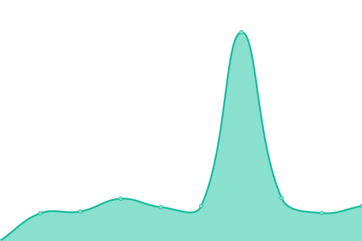

# [📈 Live Status](https://demo.upptime.js.org): <!--live status--> **🟧 Partial outage**

This repository contains the open-source uptime monitor and status page for [Jay Binks](https://demo.upptime.js.org), powered by [Upptime](https://github.com/upptime/upptime).

With [Upptime](https://upptime.js.org), you can get your own unlimited and free uptime monitor and status page, powered entirely by a GitHub repository. We use [Issues](https://github.com/jaybinks/symbio_uptime/issues) as incident reports, [Actions](https://github.com/jaybinks/symbio_uptime/actions) as uptime monitors, and [Pages](https://demo.upptime.js.org) for the status page.

<!--start: status pages-->
<!-- This summary is generated by Upptime (https://github.com/upptime/upptime) -->
<!-- Do not edit this manually, your changes will be overwritten -->
<!-- prettier-ignore -->
| URL | Status | History | Response Time | Uptime |
| --- | ------ | ------- | ------------- | ------ |
|  [Hoth](https://hoth.one/) | 🟩 Up | [hoth.yml](https://github.com/jaybinks/symbio_uptime/commits/HEAD/history/hoth.yml) | 

 548ms
     
 | 

<a href="https://jaybinks.github.io/symbio_uptime/history/hoth">100.00%</a>
    

|  [Symbio Enterprise - Portal](https://login.manage.symbioenterprise.global/) | 🟩 Up | [symbio-enterprise-portal.yml](https://github.com/jaybinks/symbio_uptime/commits/HEAD/history/symbio-enterprise-portal.yml) | 

 1998ms
     
 | 

<a href="https://jaybinks.github.io/symbio_uptime/history/symbio-enterprise-portal">100.00%</a>
    

|  [Symbio Connect - MyPortal](https://myportal.symbionetworks.com) | 🟩 Up | [symbio-connect-my-portal.yml](https://github.com/jaybinks/symbio_uptime/commits/HEAD/history/symbio-connect-my-portal.yml) | 

 1615ms
     
 | 

<a href="https://jaybinks.github.io/symbio_uptime/history/symbio-connect-my-portal">100.00%</a>
    

|  [Symbio API](https://api.symbionetworks.com/v3/common/titles) | 🟩 Up | [symbio-api.yml](https://github.com/jaybinks/symbio_uptime/commits/HEAD/history/symbio-api.yml) | 

 593ms
     
 | 

<a href="https://jaybinks.github.io/symbio_uptime/history/symbio-api">100.00%</a>
    

|  [AdvancePBX Portal](https://portal.advancedpbx.com.au/portal/) | 🟩 Up | [advance-pbx-portal.yml](https://github.com/jaybinks/symbio_uptime/commits/HEAD/history/advance-pbx-portal.yml) | 

 669ms
     
 | 

<a href="https://jaybinks.github.io/symbio_uptime/history/advance-pbx-portal">100.00%</a>
    

|  [Octane - TIAB](https://octane.telcoinabox.com/tiab/Login) | 🟩 Up | [octane-tiab.yml](https://github.com/jaybinks/symbio_uptime/commits/HEAD/history/octane-tiab.yml) | 

 106ms
     
 | 

<a href="https://jaybinks.github.io/symbio_uptime/history/octane-tiab">100.00%</a>
    

|  [Assist Portal](https://assistportal.io) | 🟩 Up | [assist-portal.yml](https://github.com/jaybinks/symbio_uptime/commits/HEAD/history/assist-portal.yml) | 

 594ms
     
 | 

<a href="https://jaybinks.github.io/symbio_uptime/history/assist-portal">100.00%</a>
    

|  [TIAB identity](https://tiab-identity.telcoinabox.com.au) | 🟥 Down | [tiab-identity.yml](https://github.com/jaybinks/symbio_uptime/commits/HEAD/history/tiab-identity.yml) | 

 1249ms
     
 | 

<a href="https://jaybinks.github.io/symbio_uptime/history/tiab-identity">0.00%</a>
    

|  [TIAB Octane API](https://api-octane.telcoinabox.com.au) | 🟩 Up | [tiab-octane-api.yml](https://github.com/jaybinks/symbio_uptime/commits/HEAD/history/tiab-octane-api.yml) | 

 2411ms
     
 | 

<a href="https://jaybinks.github.io/symbio_uptime/history/tiab-octane-api">99.53%</a>
    

|  [Sonar - mvp02nz.symbionetworks.com](mvp02nz.symbionetworks.com) | 🟥 Down | [sonar-mvp02nz-symbionetworks-com.yml](https://github.com/jaybinks/symbio_uptime/commits/HEAD/history/sonar-mvp02nz-symbionetworks-com.yml) | 

 0ms
     
 | 

<a href="https://jaybinks.github.io/symbio_uptime/history/sonar-mvp02nz-symbionetworks-com">0.00%</a>
    

|  [Netbox](https://netbox.symbio.global/) | 🟩 Up | [netbox.yml](https://github.com/jaybinks/symbio_uptime/commits/HEAD/history/netbox.yml) | 

 627ms
     
 | 

<a href="https://jaybinks.github.io/symbio_uptime/history/netbox">100.00%</a>
    

<!--end: status pages-->

[**Visit our status website →**](https://demo.upptime.js.org)

## 📄 License

- Powered by: [Upptime](https://github.com/upptime/upptime)
- Code: [MIT](./LICENSE) © [Anand Chowdhary](https://anandchowdhary.com), supported by [Pabio](https://pabio.com)
- Data in the `./history` directory: [Open Database License](https://opendatacommons.org/licenses/odbl/1-0/)
