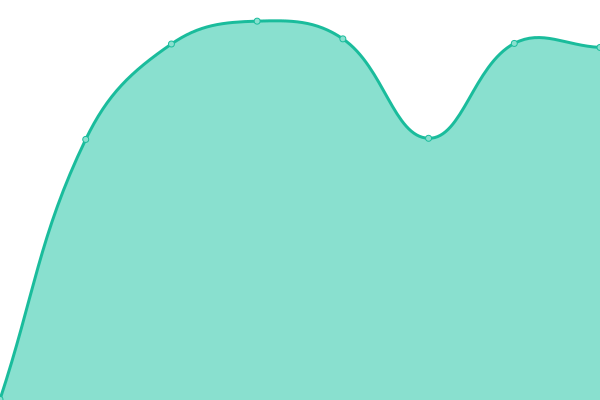

# [📈 Live Status](https://demo.upptime.js.org): <!--live status--> **🟧 Partial outage**

This repository contains the open-source uptime monitor and status page for [Jay Binks](https://demo.upptime.js.org), powered by [Upptime](https://github.com/upptime/upptime).

With [Upptime](https://upptime.js.org), you can get your own unlimited and free uptime monitor and status page, powered entirely by a GitHub repository. We use [Issues](https://github.com/jaybinks/symbio_uptime/issues) as incident reports, [Actions](https://github.com/jaybinks/symbio_uptime/actions) as uptime monitors, and [Pages](https://demo.upptime.js.org) for the status page.

<!--start: status pages-->
<!-- This summary is generated by Upptime (https://github.com/upptime/upptime) -->
<!-- Do not edit this manually, your changes will be overwritten -->
<!-- prettier-ignore -->
| URL | Status | History | Response Time | Uptime |
| --- | ------ | ------- | ------------- | ------ |
|  [Google](https://hoth.one/) | 🟩 Up | [google.yml](https://github.com/jaybinks/symbio_uptime/commits/HEAD/history/google.yml) | 

 524ms
     
 | 

<a href="https://demo.upptime.js.org/history/google">100.00%</a>
    

|  [Hoth](https://hoth.one/) | 🟩 Up | [hoth.yml](https://github.com/jaybinks/symbio_uptime/commits/HEAD/history/hoth.yml) | 

 163ms
     
 | 

<a href="https://demo.upptime.js.org/history/hoth">100.00%</a>
    

|  [Sonar ??](http://125.213.164.12:8080/sonar_admin/) | 🟥 Down | [sonar.yml](https://github.com/jaybinks/symbio_uptime/commits/HEAD/history/sonar.yml) | 

 0ms
     
 | 

<a href="https://demo.upptime.js.org/history/sonar">7.51%</a>
    

|  [Sonar - mvp02.symbionetworks.com](mvp02.symbionetworks.com) | 🟥 Down | [sonar-mvp02-symbionetworks-com.yml](https://github.com/jaybinks/symbio_uptime/commits/HEAD/history/sonar-mvp02-symbionetworks-com.yml) | 

 0ms
     
 | 

<a href="https://demo.upptime.js.org/history/sonar-mvp02-symbionetworks-com">20.37%</a>
    

<!--end: status pages-->

[**Visit our status website →**](https://demo.upptime.js.org)

## 📄 License

- Powered by: [Upptime](https://github.com/upptime/upptime)
- Code: [MIT](./LICENSE) © [Anand Chowdhary](https://anandchowdhary.com), supported by [Pabio](https://pabio.com)
- Data in the `./history` directory: [Open Database License](https://opendatacommons.org/licenses/odbl/1-0/)
